# KIWI-Video 架构图

本文档包含KIWI-Video系统的各种架构图和流程图。

---

## 系统总体架构

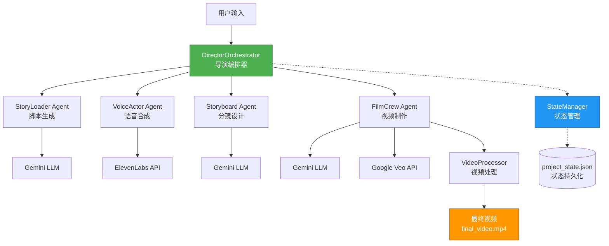

---

## 完整工作流程序列图

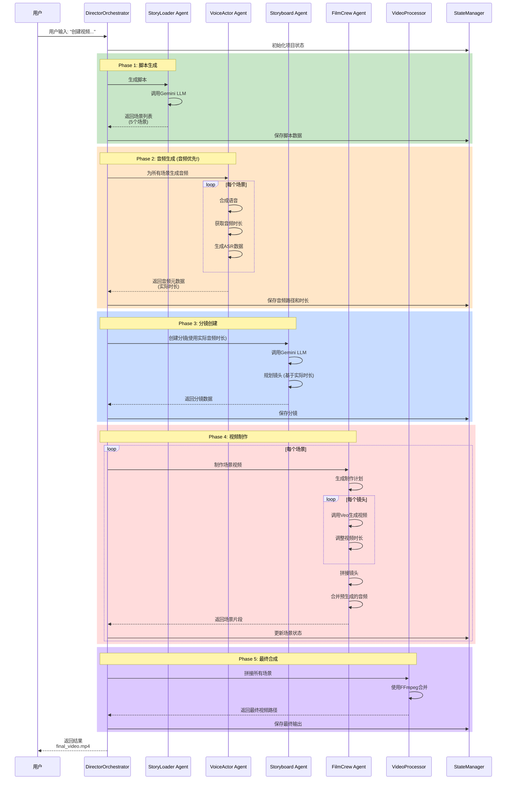

---

## 音频优先工作流对比

### 传统流程 (有问题)

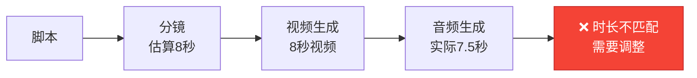

### KIWI-Video音频优先流程 (正确)

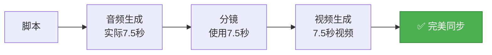

---

## Agent详细工作流

### StoryLoader Agent

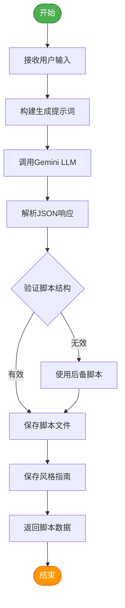

### VoiceActor Agent

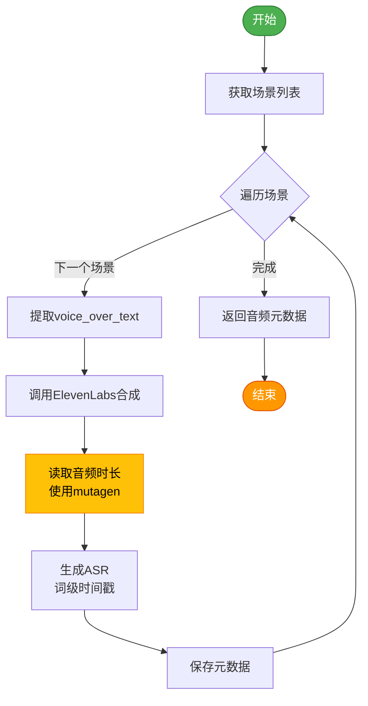

### Storyboard Agent

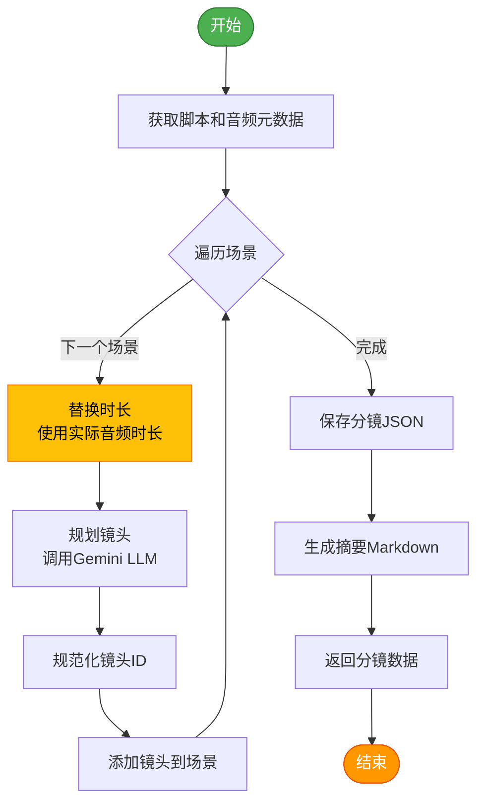

### FilmCrew Agent

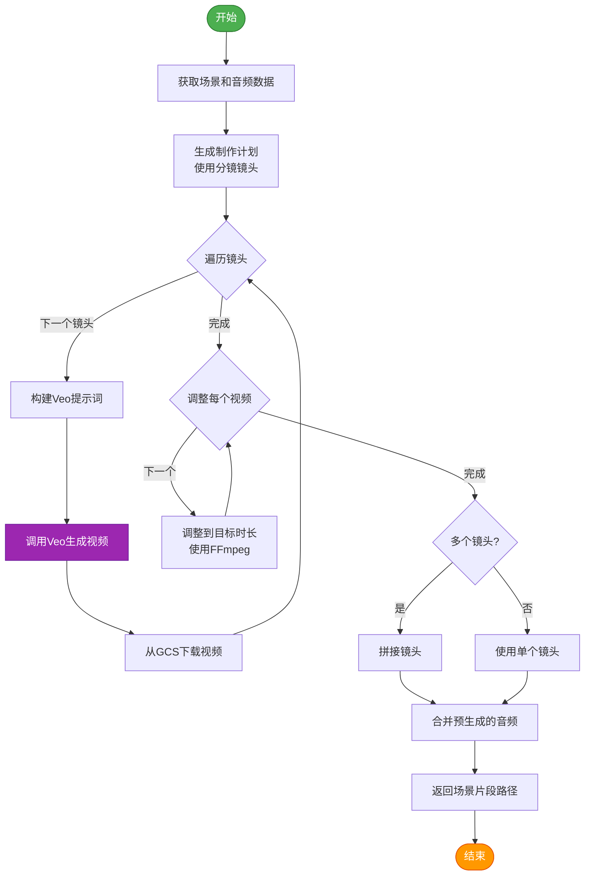

---

## 数据流图

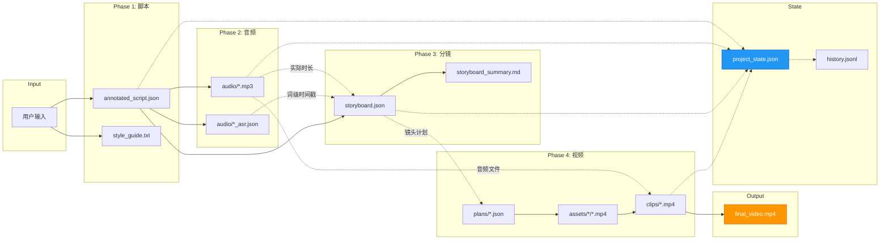

---

## 状态转换图

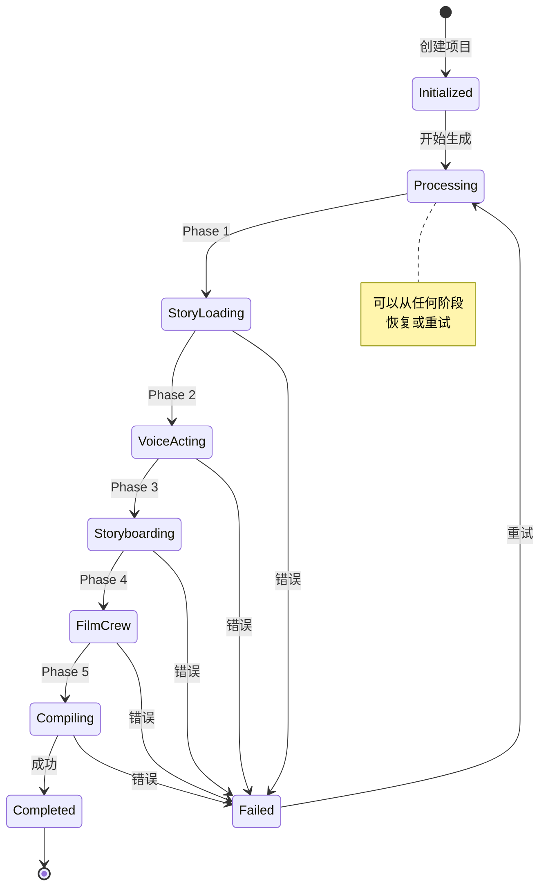

---

## Provider架构

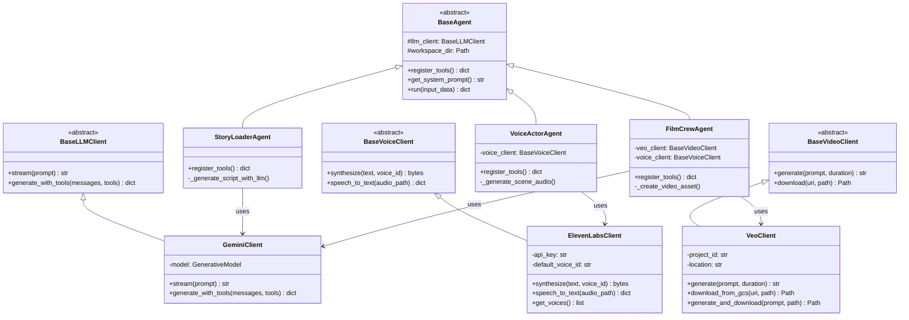

---

## 工作区文件结构

```mermaid
graph TD
    Root[workspaces/project_xyz/] --> State[project_state.json]
    Root --> History[history.jsonl]
    Root --> Script[annotated_script.json]
    Root --> Guide[style_guide.txt]
    
    Root --> AudioDir[audio/]
    AudioDir --> Audio1[scene_001_voice.mp3]
    AudioDir --> ASR1[scene_001_asr.json]
    AudioDir --> Audio2[scene_002_voice.mp3]
    AudioDir --> ASR2[scene_002_asr.json]
    
    Root --> Storyboard[storyboard.json]
    Root --> Summary[storyboard_summary.md]
    
    Root --> PlansDir[plans/]
    PlansDir --> Plan1[scene_001_production_plan.json]
    PlansDir --> Plan2[scene_002_production_plan.json]
    
    Root --> AssetsDir[assets/]
    AssetsDir --> Scene1Dir[scene_001/]
    Scene1Dir --> Shot1[scene_001_shot_001_V0.mp4]
    Scene1Dir --> Shot2[scene_001_shot_002_V0.mp4]
    
    Root --> ClipsDir[clips/]
    ClipsDir --> Clip1[scene_001_clip.mp4]
    ClipsDir --> Clip2[scene_002_clip.mp4]
    
    Root --> TempDir[temp/]
    TempDir --> AdjustedDir[adjusted/]
    TempDir --> ConcatFile[scene_001_concat.mp4]
    
    Root --> Final[final_video.mp4]
    
    style State fill:#2196F3,stroke:#1565C0,color:#fff
    style Final fill:#FF9800,stroke:#E65100,color:#fff
    style Audio1 fill:#FFC107,stroke:#F57C00,color:#000
    style Audio2 fill:#FFC107,stroke:#F57C00,color:#000
```

---

## API端点架构

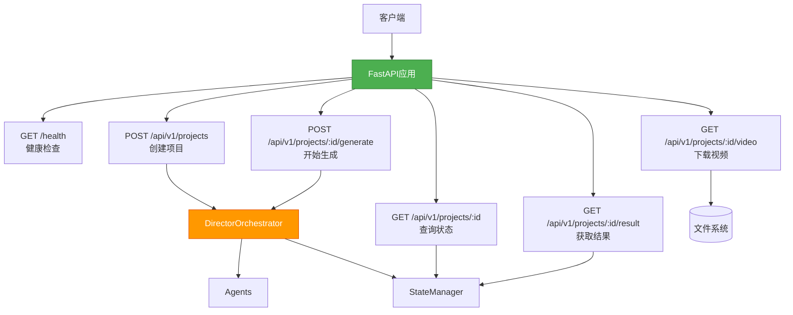

---

## 部署架构 (Docker)

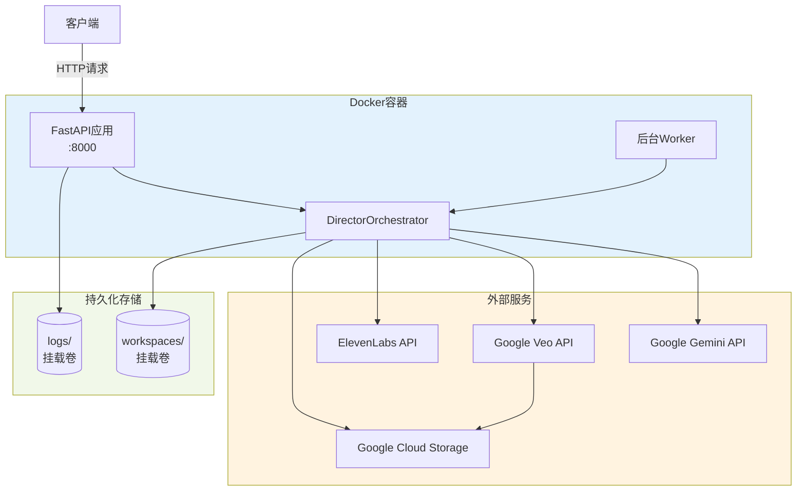

---

## 性能优化流程

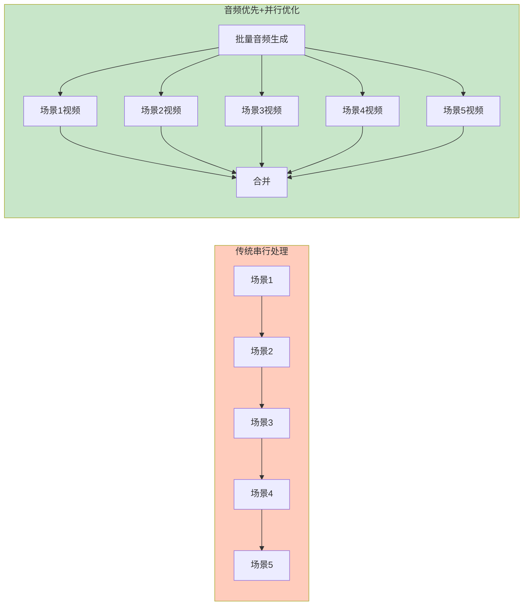

---

## 错误处理和重试机制

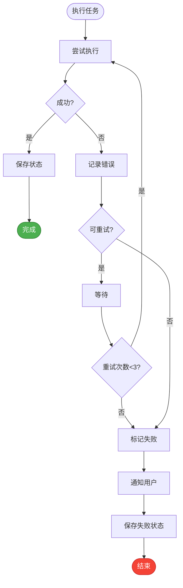

---

以上架构图展示了KIWI-Video系统的各个方面。这些图表可以帮助理解:

1. **整体架构** - 系统各组件如何协作
2. **工作流程** - 从用户输入到最终视频的完整流程
3. **Agent设计** - 每个智能体的内部逻辑
4. **数据流向** - 数据如何在各阶段间传递
5. **状态管理** - 项目状态如何变化
6. **API设计** - 外部接口如何暴露功能
7. **部署架构** - 如何在生产环境部署

如需更详细的说明,请参考 [TECHNICAL_DOCUMENTATION.md](TECHNICAL_DOCUMENTATION.md)

